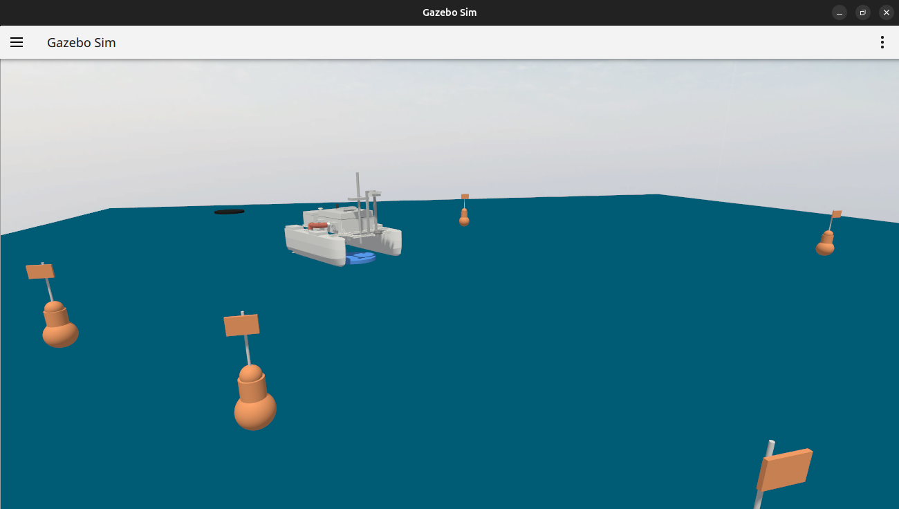
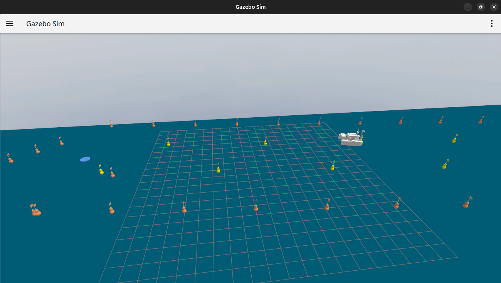
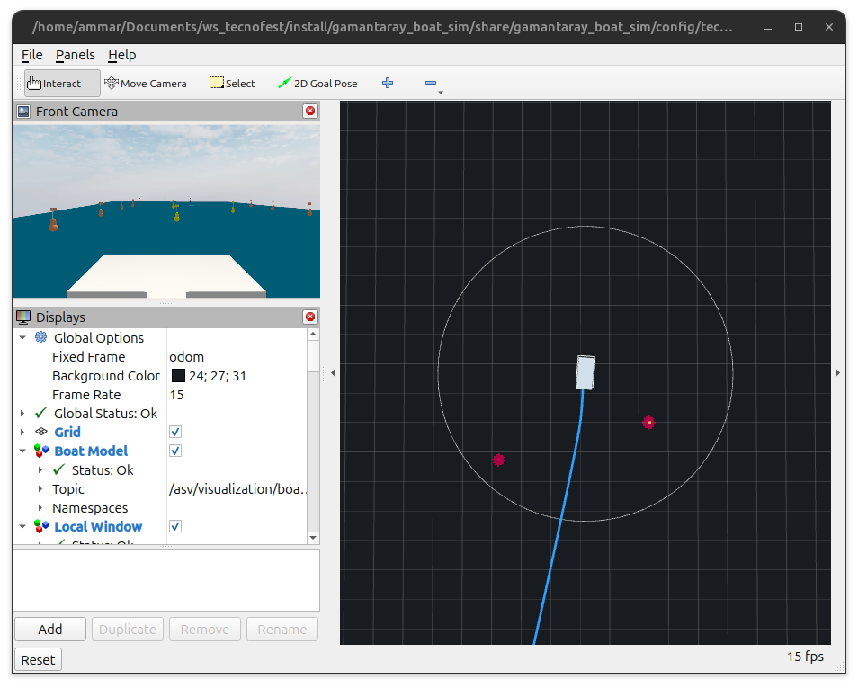

# Gamantaray — Simulasi ASV TEKNOFEST

Simulasi kapal tanpa awak (Autonomous Surface Vehicle) **Gamantaray** untuk
kompetisi **TEKNOFEST**. Kapal bernavigasi secara otonom melewati lintasan air
dengan buoy zig-zag, obstacle, dan target, menggunakan ROS 2 Jazzy dan Gazebo
Harmonic.

## Tampilan Simulasi

### Gazebo — Lingkungan 3D



Kapal Gamantaray bernavigasi di antara buoy-buoy batas lintasan. Terlihat
model kapal dengan dual thruster, LiDAR mast, dan kamera depan.



Overview lintasan TEKNOFEST seluas 100 × 20 m. Buoy oranye menandai batas
koridor zig-zag (Parkur 1), buoy kuning adalah obstacle (Parkur 2), dan
marker biru menandai checkpoint GN1–GN5.

### RViz2 — Navigasi & Sensor



Tampilan RViz2 menunjukkan path navigasi Nav2 (garis biru), area local costmap
(lingkaran), marker obstacle dari clustering LiDAR (titik merah), serta
feed kamera depan kapal (kiri atas).

## Fitur Utama

- **Navigasi otonom** — Nav2 waypoint mission melewati 5 checkpoint (GN1–GN5)
- **Obstacle avoidance** — LiDAR 2D + Spatio-Temporal Voxel Layer (STVL) yang
  otomatis membuang noise ombak
- **Dual thruster** — Dua propeller independen untuk maju, mundur, dan belok
- **Sensor lengkap** — LiDAR, kamera depan, GPS, dan IMU
- **3 mode navigasi** — Nav2 (otonom), Manual (teleop), ArduPilot (SITL +
  MAVROS)
- **3 parkur kompetisi** — Zig-zag buoy, koridor obstacle, dan target warna

## Menjalankan Simulasi

```bash
# Build workspace
cd /home/ammar/Documents/ws_tecnofest
source /opt/ros/jazzy/setup.bash
colcon build --symlink-install
source install/setup.bash

# Jalankan simulasi (Nav2 otonom)
ros2 launch gamantaray_boat_sim simple_ocean_gamantaray.launch.py

# Atau mode manual
ros2 launch gamantaray_boat_sim simple_ocean_gamantaray.launch.py navigation_mode:=manual
```

## Struktur Package

```
src/
├── gamantaray_boat_sim/          # Package utama simulasi
│   ├── config/                   # Parameter Nav2, waypoint, RViz
│   ├── gamantaray_boat_sim/      # Node-node Python (thruster, LiDAR, misi)
│   ├── launch/                   # Launch file utama
│   ├── models/                   # Model kapal, buoy, dan ocean wave
│   ├── plugins/                  # Library gz-waves untuk hidrodinamika
│   └── worlds/                   # World SDF lintasan TEKNOFEST
└── gamantaray_nav2_bt_plugins/   # Custom Behavior Tree plugin untuk Nav2
```

## Dokumentasi Teknis

| Dokumen | Isi |
|---------|-----|
| [NAVIGATION.md](src/gamantaray_boat_sim/NAVIGATION.md) | Alur navigasi, waypoint, obstacle avoidance, thruster, debug |
| [doc_nav2.md](src/gamantaray_boat_sim/doc_nav2.md) | Dokumentasi lengkap kode Nav2 dan alur data |
| [optimasi.md](src/gamantaray_boat_sim/optimasi.md) | Panduan optimasi performa navigasi dan costmap |
